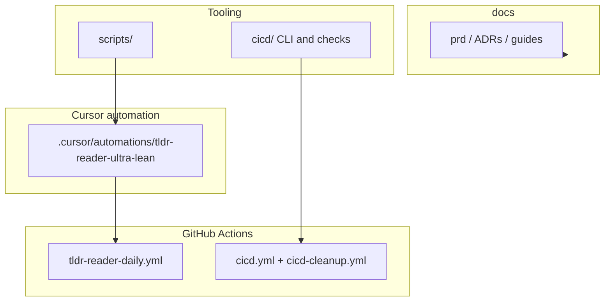

# Repository architecture

This document describes how the repository is organized today and how automation and CI interact. For product intent and artifact schemas, see [docs/prd/tldr-research-ops.prd.md](docs/prd/tldr-research-ops.prd.md).

## High-level map

## Directory layout

| Path | Role |
|------|------|
| `docs/` | PRD, ADRs, setup, orchestration guides, and [docs/cicd/](docs/cicd/) for the CICD subsystem |
| `.cursor/plans/` | Cursor plan markdown files used by orchestration docs |
| `.cursor/automations/tldr-reader-ultra-lean/` | TLDR Reader prompts, `automation-spec.yaml`, memory schemas, optional Playwright helper |
| `scripts/` | Small utilities; only `validate-tldr-reader.sh` is tracked (see `.gitignore`) |
| `cicd/` | Vendored CICD package: CLI (`cicd/bin/cicd`), checks, judges, templates, tests |
| `.cicd/` | Repo-local CICD config, allowlists, and generated output (output is gitignored) |
| `.github/workflows/` | `tldr-reader-daily.yml`, `cicd.yml`, `cicd-cleanup.yml` |

## TLDR Reader automation

**Primary:** Cursor Automations UI or Playwright-assisted setup (see automation README).

**Fallback:** [`.github/workflows/tldr-reader-daily.yml`](.github/workflows/tldr-reader-daily.yml) calls the Cursor Cloud Agents API on a schedule or via `workflow_dispatch`.

**Secrets (GitHub Actions):** the workflow resolves the API key in this order: `CURSOR_AGENTS_API_KEY`, then `CURSOR_API_KEY`, then `CURSOR_CLOUD_AGENTS_API_KEY`. Prefer setting only **`CURSOR_AGENTS_API_KEY`** in production to avoid ambiguity.

**Validation:** `sh scripts/validate-tldr-reader.sh` checks required files and that the automation spec and README stay aligned (including cron strings).

## CICD pipeline

The repo dogfoods the **`cicd/`** package. On pull requests, [`.github/workflows/cicd.yml`](.github/workflows/cicd.yml) runs deterministic gates (branch naming, size, secrets, doc parity, lint hook, tests hook) and optional LLM judges. Configuration lives in [`.cicd/config.yaml`](.cicd/config.yaml).

- **Operator docs:** [docs/cicd/README.md](docs/cicd/README.md) and sibling pages under `docs/cicd/`.
- **Agent-oriented secrets and judge backends:** [AGENTS.md](AGENTS.md).
- **Tests:** `bash cicd/tests/run-tests.sh`.

## Branches

- **`main`:** integration branch; GitHub Actions workflows run from here.
- **`develop`:** long-lived branch; kept aligned with `main` when the team fast-forwards or merges policy dictates.

## Related reading

- [docs/adr/](docs/adr/) — architecture decisions (scheduling, storage, safety gates, etc.)
- [docs/guides/plan-orchestrator.md](docs/guides/plan-orchestrator.md) — running `.cursor/plans` in separate agent contexts
